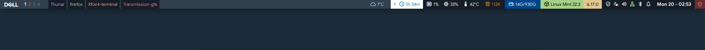

# Polybar Dell Rice

Custom polybar + jgmenu setup for **Linux Mint XFCE** with a Dell OptiPlex branded look.
Dynamic hardware monitor, workspace switcher, tasklist, app launcher with recent apps, and a solid blue navy aesthetic.

## Preview



---

## Features

### Bar
- **Custom Dell logo** as a font glyph (generated from SVG via FontForge)
- **Workspace switcher** (clickable 1 2 3 4)
- **Tasklist** with per-window colored text, unified background
- **Weather** from wttr.in with day/night sun icons (auto-refresh 30min)
- **Hardware panel** (auto-hide): CPU, RAM, Temperature, Trash — auto-shows on warning thresholds
- **Disk** always visible with used/total (`26G/1.0T`)
- **Uptime** (hours + minutes format)
- **Distro + kernel** as separate pills (Linux Mint green / kernel version yellow)
- **Updates** module (apt upgradable count)
- **Power Manager** quick access
- **Volume** with scroll wheel, mute toggle, hover % display
- **Network** with dynamic icon (LAN/WiFi/disconnected) and ping-based internet status
- **Bluetooth** with state colors (off red, on not connected yellow, connected white)
- **Notifications** with Do Not Disturb toggle
- **Date** with calendar on click
- **Power/shutdown** button (red accent)

### Menu (jgmenu)
- Favorites in top (Firefox, Terminal, Files)
- **All Applications** submenu (XDG auto-populated with icons)
- **Recent Apps** — tracks last 10 apps clicked, most recent first
- Lock screen, Log out
- White theme with Dell blue hover

### Design
- Font: **Google Sans** (fallback to Ubuntu)
- Icons: **Material Symbols Outlined**
- Menu font: **Roboto**
- Palette: **Catppuccin Frappé** accents, navy `#33404e` base
- Dell blue `#0076ce` for branding

---

## Installation

### Requirements
- Linux Mint 22.x XFCE (or any Debian-based XFCE: Ubuntu, Debian, MX Linux)
- XFCE 4.18+
- `sudo` privileges for package installation

### Quick install

```bash
git clone https://github.com/<YOUR_USERNAME>/polybar-dell.git
cd polybar-dell
chmod +x install.sh
./install.sh
```

That's it. The script handles everything — packages, fonts, configs, autostart.

### What the install script does

1. Installs apt packages: `polybar jgmenu fontforge python3-fontforge sqlite3 wmctrl xdotool curl network-manager-gnome xfce4-power-manager blueman lm-sensors fonts-roboto gnome-calendar papirus-icon-theme`
2. Downloads **Material Symbols Outlined** font from Google's GitHub (~10MB)
3. Generates a **Dell Logo TTF font** from the SVG in `polybar/assets/dell.svg` using FontForge
4. (Optional) Falls back to Ubuntu font if Google Sans isn't installed
5. Copies `polybar/` → `~/.config/polybar/`
6. Copies `jgmenu/` → `~/.config/jgmenu/`
7. Sets executable permissions on all scripts
8. Adds `polybar` to XFCE autostart
9. Disables `xfce4-panel` autostart (to avoid visual conflicts)
10. Enables notification logging for `xfce4-notifyd`
11. (Optional) Sets a solid desktop background `#1d2c3b`
12. Kills any running panel and launches polybar

### About Google Sans

Google Sans is used as the main UI font but is **not freely distributable** — Google has it licensed only for their products. The install script detects if it's missing and offers to fall back to Ubuntu font automatically.

If you want Google Sans:
- Download TTF files manually (e.g. from unofficial mirrors like [mobiledesres/Google-Sans-web-fonts](https://github.com/mobiledesres/Google-Sans-web-fonts))
- Place them in `~/.local/share/fonts/Google_Sans/`
- Run `fc-cache -f`

Or use the officially open-source [Google Sans Flex](https://fonts.google.com/specimen/Google+Sans+Flex) (released Nov 2025 under SIL OFL).

---

## Usage

- **Click Dell logo** → open jgmenu
- **Click `‹` / `›` arrow** → toggle hardware panel (CPU, RAM, Temp, Trash)
- **Scroll on volume** → adjust (% shows for 3 seconds after scroll)
- **Click date** → open GNOME Calendar
- **Click power** (red, right edge) → XFCE session logout
- **Click weather** → open BBC Weather page
- **Click any hardware icon** → open `xfce4-taskmanager`

### Hardware auto-show thresholds

When these values exceed the warn threshold, the hardware panel opens automatically:

| Metric | Warn | Critical |
|--------|------|----------|
| CPU usage | 50% | 85% |
| RAM usage | 70% | 90% |
| Temperature | 65°C | 85°C |
| Disk usage | 75% | 92% |

---

## Customization

All config is in `~/.config/polybar/` — edit and run `~/.config/polybar/launch.sh` to reload.

### Change colors

Edit `~/.config/polybar/scripts/*.sh` — each script has `color="#XXXXXX"` variables.
Bar background is in `~/.config/polybar/config.ini` under `[colors]`:

```ini
bg = #33404e
fg = #ffffff
```

### Change fonts

Edit the `[bar/main]` section of `config.ini`:

```ini
font-0 = Google Sans:size=9;2
font-1 = Material Symbols Outlined:size=12;3
font-2 = Google Sans:weight=bold:size=10;2
font-3 = Dell Logo:size=12;5
```

### Add modules

1. Create `~/.config/polybar/scripts/mymodule.sh` (must output polybar-compatible text)
2. Add `[module/mymodule]` section in `config.ini`
3. Add `mymodule` to `modules-left`, `modules-center`, or `modules-right`
4. Reload: `~/.config/polybar/launch.sh`

---

## Troubleshooting

### Polybar won't start

```bash
tail -f /tmp/polybar.log
```

Common causes: missing font, script error, duplicate polybar instance.

### Missing icons (empty squares)

Material Symbols is not installed or font cache is stale:

```bash
fc-cache -f
~/.config/polybar/launch.sh
```

### jgmenu shows "Fatal: menu"

Lockfile from previous instance:

```bash
rm -f ~/.jgmenu-lockfile
pkill -9 jgmenu
```

### High CPU usage

Usually caused by a script with `interval = 0` that's not intended as tail mode. Check:

```bash
ps aux | grep -E '^$USER.*polybar' | awk '{print $3}'
```

If above 10%, inspect which script is looping:

```bash
ls /proc/$(pgrep polybar)/task | while read t; do
    cat /proc/$(pgrep polybar)/task/$t/comm
done | sort | uniq -c
```

### Hardware panel won't open on warn

Check that IPC is enabled:

```bash
grep "enable-ipc" ~/.config/polybar/config.ini
# Should show: enable-ipc = true
```

### Recent Apps not tracking

Verify:

```bash
ls -la ~/.cache/jgmenu-recent-apps
cat ~/.cache/jgmenu-recent-apps
```

If empty, the `runapp.sh` wrapper isn't being called. Refresh jgmenu cache:

```bash
rm -rf ~/.cache/jgmenu
pkill -9 jgmenu
rm -f ~/.jgmenu-lockfile
```

---

## Uninstall

```bash
pkill polybar
rm -rf ~/.config/polybar
rm -rf ~/.config/jgmenu
rm ~/.config/autostart/polybar.desktop
rm ~/.config/autostart/xfce4-panel.desktop

# (Optional) Remove fonts
rm ~/.local/share/fonts/DellLogo.ttf
rm ~/.local/share/fonts/MaterialSymbolsOutlined.ttf
fc-cache -f

# (Optional) Restore xfce4-panel
xfce4-panel &
```

---

## License

MIT License. Dell logo is trademark of Dell Technologies — used here for personal branding purposes only, not for redistribution.

---

## Credits

- **Polybar** — https://github.com/polybar/polybar
- **jgmenu** — https://jgmenu.github.io/
- **Material Symbols** — Google (Apache 2.0)
- **Catppuccin Frappé palette** — https://github.com/catppuccin/catppuccin
- **FontForge** — https://fontforge.org/

Built with way too many sed commands, on a Dell OptiPlex 3080. 🚀
